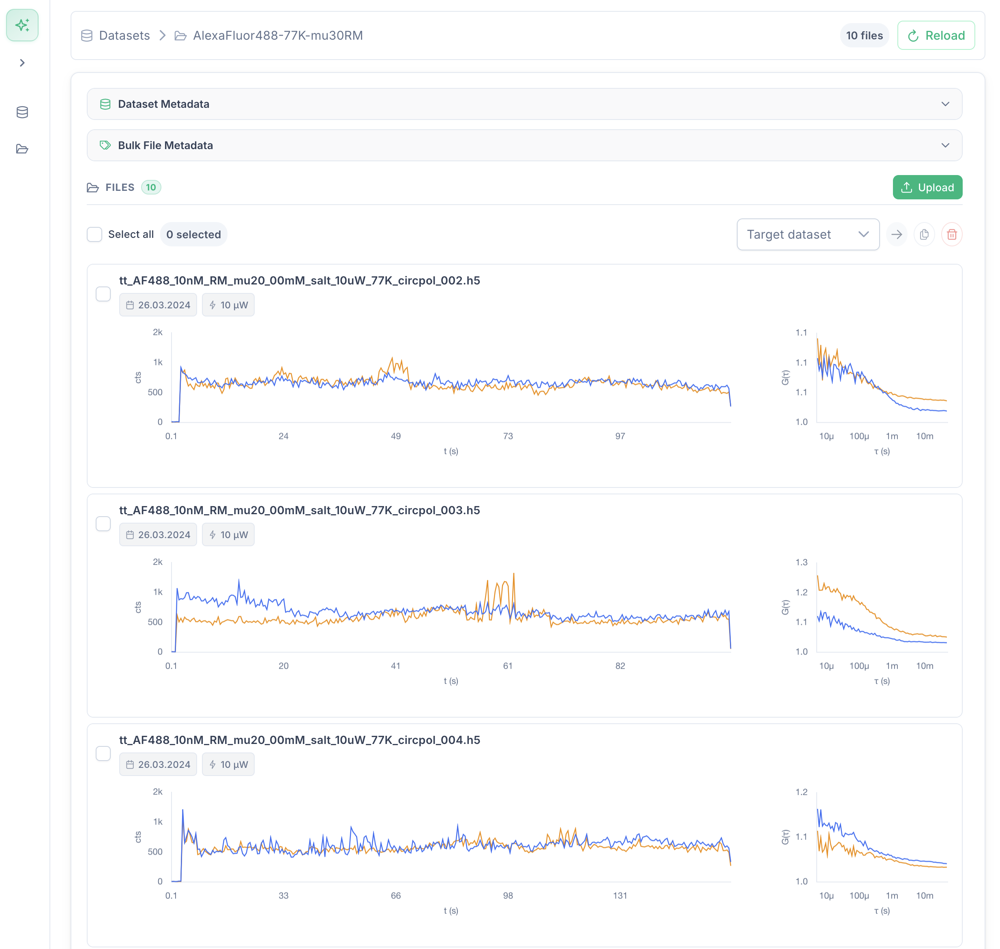
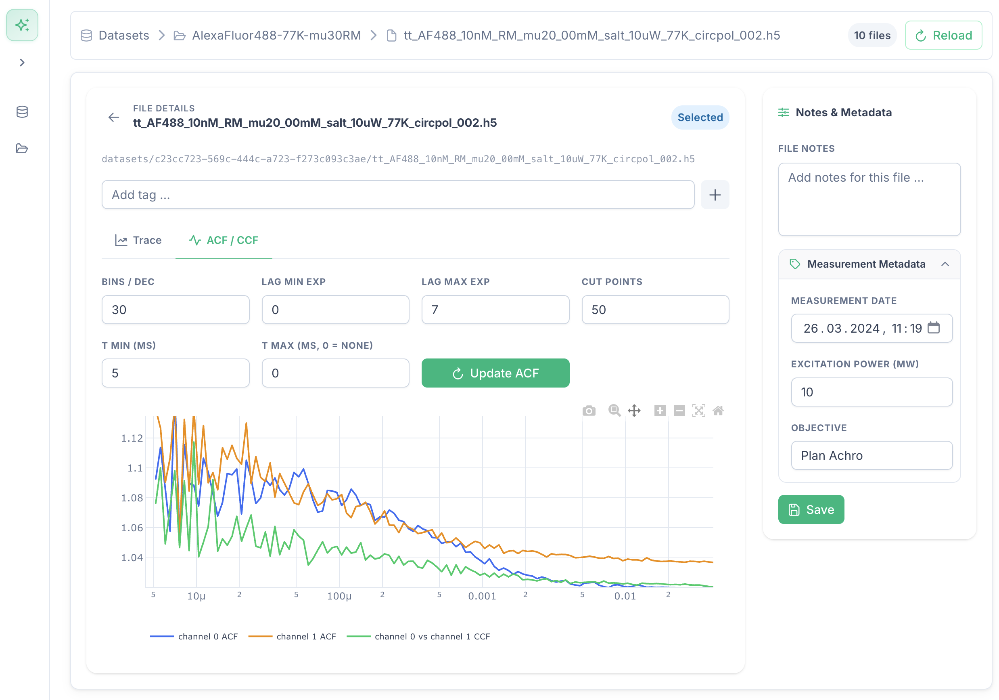
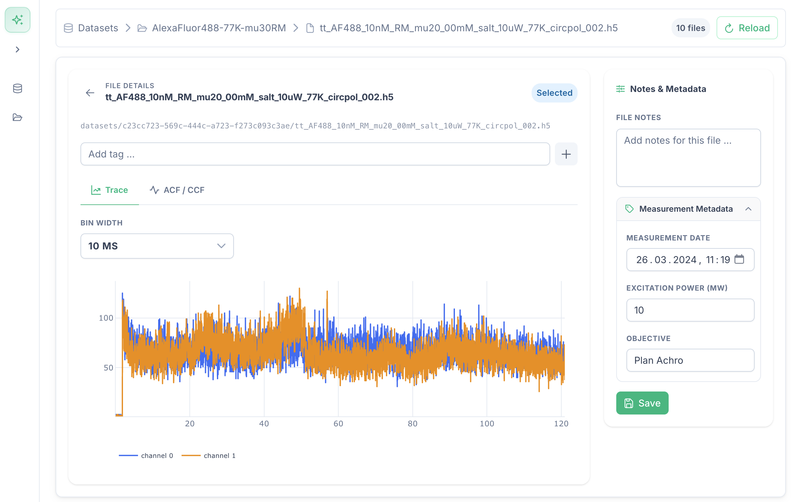

# Photon Data Hub

Cloud-native platform for organizing and previewing TCSPC measurement datasets.

## Overview

In many labs TCSPC measurement data ends up in loosely organized folders, with metadata spread across file names and lab notebooks. Photon Data Hub provides a structured platform to store, annotate and visually explore datasets without leaving the browser.



## Features

**Dataset management**
- Create and organize datasets
- Upload `.h5` measurement files
- Bulk move, copy, or delete files across datasets

**Metadata**
- Per-file and bulk editing of measurement date, excitation power, and objective
- Auto-detection of metadata from file names and timestamps on upload
- Free-text notes per file and dataset
- Tagging system for flexible categorization

**Previews**
- Inline time trace thumbnails for every file
- Inline ACF (autocorrelation) thumbnails per file
- Full-resolution interactive trace viewer with configurable bin width



**ACF / CCF analysis**
- Per-channel ACF and cross-correlation (CCF) computed on demand
- Configurable lag range, bins per decade, cut points, and τ window
- Plotly-powered interactive plot with zoom and pan



## Tech Stack

| Layer | Technology |
|---|---|
| Frontend | Vue 3, Vite, PrimeVue, Chart.js, Plotly |
| Backend | FastAPI, SQLAlchemy, Alembic |
| Database | PostgreSQL |
| Object storage | MinIO (S3-compatible) |
| Infrastructure | Docker Compose |

The object storage layer uses the S3 protocol via `boto3`, so MinIO can be swapped for any S3-compatible provider (Cloudflare R2, Backblaze B2, AWS S3) by changing environment variables — no code changes required.

## Getting Started

**Prerequisites:** Docker and Docker Compose.

```bash
cp .env.example .env   # fill in credentials
docker compose up
```

The API will be available at `http://localhost:8000` and the frontend dev server at `http://localhost:5173`.

Run database migrations:

```bash
docker compose exec api alembic upgrade head
```

## Environment Variables

| Variable | Description |
|---|---|
| `POSTGRES_USER` | Database user |
| `POSTGRES_PASSWORD` | Database password |
| `POSTGRES_DB` | Database name |
| `S3_ENDPOINT` | Internal S3 endpoint (e.g. `http://minio:9000`) |
| `S3_PUBLIC_ENDPOINT` | Public S3 endpoint for presigned URLs |
| `S3_ACCESS_KEY` | S3 access key |
| `S3_SECRET_KEY` | S3 secret key |
| `S3_BUCKET` | Bucket name |
| `S3_REGION` | Region (e.g. `us-east-1`) |